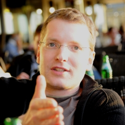

= Curriculum Vitae - Dag Wieërs - Linux Engineer
:author: Dag Wieërs
:data-uri:
:doctype: article
:encoding: UTF-8
:lang: en
:quirks:
:theme: cv
:toclevels: 2
:linux-experience: {sys:echo $(( $(date +%Y) - 1995 ))}
//:curr-job-years: +{sys:echo "scale=1; ( $(date +%s) - $(date --date='2016-01-01' +%s) ) / 12 / 30 / 24 / 60 / 60" | bc}
:curr-job-months: {sys:echo "( $(date +%s) - $(date --date='2016-01-01' +%s) ) / 30 / 24 / 60 / 60" | bc}
:dagit-years: +{sys:echo "scale=1; ( $(date +%s) - $(date --date='2007-05-01' +%s) ) / 12 / 30 / 24 / 60 / 60" | bc}
:description: Dag Wieërs is an experienced Linux system engineer and +
system architect, focusing on Red Hat Enterprise Linux, CentOS and +
Scientific Linux. Dag is also a well known RPM packager due to his +
efforts in the RPMforge and ELRepo repositories which is used by many +
international organizations using RHEL and CentOS.
:keywords: CV, résumé, Linux System Engineer, Linux System Administrator, +
Linux Guru, sysadmin, Linux System Architect, Ansible, freelancer, consultant, +
RPM packager, Python developer, Red Hat Enterprise Linux, RHEL, CentOS, +
Bash, KSH, shell scripting, Devops

.Expertise and availability
****************************************************************************
Dag is an experienced and certified Linux system engineer
with a focus on Linux and Open Source software, preferably Red Hat
Enterprise Linux (RHEL), CentOS or Scientific Linux. With more than
*{linux-experience} years of Linux experience*, he is one of the Linux
pioneers in Belgium and known within the Red Hat Linux communities.

Skills include:

 - deploying, migrating and managing Linux-based infrastructure
 - designing and implementing system tools, packaging software
 - improving hardware support and vendor management
 - capacity planning, troubleshooting and performance tuning
 - security incident handling and security auditing
 - automating using Ansible, Python, Perl or shell scripting
   with attention to detail, standardization, processes and policies
// - automating using Ansible, Python, Perl or shell scripting with attention
//   to detail, documentation, standardization, procedures and policies

// Dag is *available as a freelancer for contract work* inside and outside
// of Europe, but not able to relocate on a permanent basis.
Dag is a freelancer *available for contract work* near Ghent, BE.
****************************************************************************

== Personalia
////
["qrcode",size=25,width="20mm",height="20mm",align="right"]
----
http://linkedin.com/in/dagwieers
----
////
////
[width="25mm",height="25mm",align="right"]

////
Full name::
    Dag Johan Maarten Wieërs

Location::
    Ghent, Belgium, Europe

Phone::
    +32 478 436 299

Email::
    dag@linux.com

Most recent résumé and work::
    http://dag.wiee.rs/cv/
    http://linkedin.com/in/dagwieers
    http://github.com/dagwieers

[cols=2]
== Work experience
=>  _References available on request_

=== Telenet ~Jan 2016 -> now ({curr-job-months} month)~
*Ansible Automation Engineer*

 - Analysis and implementation of Ansible for the deployment and management
   of the Yelo and Digital TV frameworks

=== ING ~Jun 2015 -> Dec 2015 (7 months)~
*Linux System Engineer*

// - Part of the _agile_ infrastructure engineering team (IaaS)
 - Assessed threats, vulnerabilities and compliance of existing RHEL deployments
 - Authored a RHEL Operational Security Guidelines (OSG) and RHEL design document
 - Involved in the migration of HP-UX and Linux systems to the ING Linux infrastructure

=== Proximus / Belgacom ~Jan 2013 -> Jun 2015 (2.6 years)~
*Linux System Engineer*

 - Design and implementation of a monthly security patching cycle for 3500+ Linux systems
 - Introduced emergency patch process in accordance with Change Management Office
 - 10-point plan of action to improve the reliability of the Linux environment
 - Auto-process coredumps, panics and crashes
 - Red Hat Satellite redesign and integration
 - Centralized syslog, clean-up of system/vendor facilities and severities
   and massive reduction of system events
 - Assessment of possible attack vectors and potential advanced persistent threats
 - 15-point plan of action to improve state of security and security practices
 - Integration of Ansible for provisioning, (firmware) patching, connectivity
   testing and general maintenance, using Red Hat Satellite, vSphere, HP iLO,
   CMDB, Infoblox, etc., including Ansible module development
 - Design and implementation of secured autonomous jumphosts with 2-factor
   authentication and idle timeout detachment
 - RHEL7 refactoring for new system deployments
// - Continuous end-to-end monitoring of network connectivity
 - Evaluation of Red Hat IdM (IPA), Gitlab and Jenkins
 - 3rd level support, troubleshooting and design work
// - Conceptual design and common engineering practices documentation
 - Authored extensive roadmap with required changes and activities for UNIX/Linux Engineering

>>>

=== Hewlett-Packard ~May 2010 -> Jul 2015 (5.3 years)~
*Linux System Developer / Engineer / Architect*

 - Troubleshoot SAN/multipathing performance problems, defined and implement
   best practices
 - Assessment and design of Linux reference architecture
 - Red Hat Satellite design and implementation
 - HP-UX ksh to Linux migration best practices
 - Aided in various Linux-related business projects
 - Identified Linux competencies throughout the organization

[darkblue]_Incl. Belgian Federal Police, Dexia Technology Services,
Atos Worldline, SWIFT, BNP Paribas Fortis, Proximus / Belgacom_

=== BNP Paribas Fortis ~May 2012 -> Dec 2012 (7 months)~
*Domain Architect Linux*
[darkblue]_(Fixed-term assignment)_

 - Solaris-to-Linux migration project
 - Design of a RHEL6 Linux standard operating environment (SOE)
 - Implementation and automation using Ansible configuration management
 - Integration with PXE/kickstart, HP Asset Manager/CMDB, VMware vSphere,
   RHEV/KVM, RHN, HP hardware, IBM Tivoli Monitoring, TSM, CommVault backup,
   Veritas Cluster Server, etc.
 - Implementation of various Ansible modules and core changes
 - Involved with TCO and ROI calculations for the migration
 - 3rd level support, troubleshooting and design work

=== Belgian Federal Police ~May 2010 -> Jul 2011 (1.3 years)~
*Linux System Developer*
[darkblue]_(Fixed-term assignment)_

 - Implemented disaster recovery solution based on Relax-and-Recover
 - Improvements to installation scripts, packaging and Webmin modules
 - Automation and integration work
 - Design and implementation of a samba/anti-virus solution
 - 3rd level support, troubleshooting and design work

<<<

=== AXA Technology Services ~Nov 2007 -> Mar 2010 (2.5 years)~
*Linux System Engineer*

 - Linux migration of Belgian data center to Germany
 - Designed and implemented of modular framework and infrastructure for Linux
   and VMware ESX, used for deploying, retrofitting and validating Linux servers
 - Tool for testing, troubleshooting and monitoring connectivity issues
 - Implementation of various business projects
 - Vendor management and problem management
 - 3rd level support, troubleshooting and design work

=== EMC ~Jul 2007 -> Dec 2007 (6 months)~
*Linux System Engineer*
[darkblue]_(Short part-time assignment)_

 - Implementation of infrastructure for Novell SLES Linux deployment for
   technical development workstations
 - Integration with Active Directory, NIS, ClearCase and VMware

=== Punch Telematix ~Jun 2007 -> Sep 2007 (4 months)~
*Linux System Engineer*
[darkblue]_(Short part-time assignment)_

 - Design and implementation of a technical documentation system and versioning system
 - Packaging for Novell SLES Linux
 - General troubleshooting and automation

=== Dagit ~May 2007 -> now ({dagit-years} years)~
*Freelance contractor*

[darkblue]_Incl. D square/Trendminer, FedICT, KULeuven, MIVB, Nanopixel, Virtwo, Belgian Federal Police_

=== Euroclear ~Dec 2005 -> May 2007 (1.5 years)~
*Unix System Engineer*

 - Deployment of Unix systems and services
 - Design and implementation of management infrastructure (configuration,
   documentation and change management)
 - Packaging for Solaris, AIX, Linux and VMware
 - Custom software development
 - 3rd level support, troubleshooting and design work

=== IBM ~internship 1999; Sep 1999 -> Dec 2005 (5.5 years)~
*Unix System Engineer*

 - Implementation of internal (outsourced) business projects
 - Packaging for Linux and AIX
 - Implementation of various system and network services
 - General in-house troubleshooting
 - Design and implementation of Linux-based hosting infrastructure
 - Developed a comprehensive resource and availability monitoring framework
 - Responsible for capacity planning
 - Linux-based firewall management framework

*Linux and GPFS Consultant*

 - Designed and implemented solutions for automatic deployment of
   Linux clients, Point-Of-Sale systems, network services, clusters
   and big parallel storage systems for digital media projects,
 - Linux GPFS specialist and all-round whiz-kid

[darkblue]_incl. Real Software, VRT, EVS, RVA, Cortal Consors Bank, KBC_

>>>

=== Mind Linux Solutions ~Oct 1999 -> Apr 2001 (1.6 years)~
*Founder / Business Unit Manager*

 - Taking care of various parts of the organization, including sales
   and marketing
 - Experience with project-management and pre-sales for a small
   (15 headcount) consultancy company.

*Consultant*

 - Linux and Open Source consulting and training for several customers
   in on-site projects varying between 1 and 3 weeks.

=== SISA Software / Winsome ~summer job 1996-1997~
*Consultant*

 - Analysis and design of an off-line website generation program (further
   developed as WebEngine) and web-scripting
 - Implementation of business projects, mostly web-based and database-driven

*System Administrator*

 - Design, implementation and operational management of Linux infrastructure and
   routers

=== Provinciale Bibliotheek Limburg ~voluntary 1996-1997~
*System/Network Administrator*

 - Maintenance of 12 public Internet terminals (based on Windows 95) and
   an ISDN Internet connection

*Internet Trainer*

 - Individual training and training in group regarding computer use,
   the Internet, search-engines and popular websites

////
["ditaa",options="no-shadows",scaling=4,width="180mm",height="15mm"]
----
                            +-------\                                                                         +----\
                            |IBM    |                                                                         |EMC²|
  +----------+--------------+----+--+------------+---------------------------------------------+------------+-+----+-----------------------+--------------------\
  |Prov. Bib |SISA/Winsome       |Mind           |IBM Belgium                                  |Euroclear   |Punch |AXA-Tech               |HP Belgium...       |
--+--*-------+-*---------*-------+-*---------*---+-----*---------*---------*---------*---------*---------*--+------*---------*---------*---+-----*---------*----+-->
    1997      1998      1999      2000      2001      2002      2003      2004      2005      2006      2007      2008      2009      2010      2011      2012
----
////

<<<

== Skills

[cols=2]
=== Overall
  - Analytical - ability to quickly learn and understand from self-study
    or analysis
  - Structured - good understanding of project management and change management
  - Thorough experience in Unix system administration, advanced automation and
    orchestration
  - Thorough experience in configuring and deploying systems in a scalable and
    coherent manner
  - Owner of various best practices regarding Linux system and application
    deployments, system maintenance and documentation, system security and
    Enterprise Linux in general
  - Experience in developing and marketing products using the Internet and
    Internet communities
  - Experience in project management and leading technical teams

[cols=2]
=== Communication
  - Direct communication skills - does not overpromise or underdeliver
  - Team player - listen, share, cooperate and learn together as a team
  - Presentation skills - experience with presenting for large groups
    in international settings
  - Agile practices - experience with Agile methodologies for infrastructure
    management

[cols=2]
=== Systems architecture
  - Experience with designing Standard Operating Environments (SOE) and
    automating Unix-to-Linux projects
  - Experience with designing Linux security standards and processes
    to harden existing environments
  - Experience with designing Linux life cycle management and
    security patch management processes
  - Experience with designing infrastructure for systems management,
    troubleshooting, monitoring and automating environments

[cols=2]
=== Systems engineering
  - Excellent knowledge of Red Hat Enterprise Linux internals, security
    best-practices, performance tuning and troubleshooting
  - Excellent experience with enterprise automation and orchestration using
    Ansible and Red Hat Network Satellite and integrating with enterprise
    CMDB solutions
  - Thorough experience with Red Hat kickstart and post-installation mechanisms
    for rapid mass deployment
  - Thorough experience with building packages and automating enterprise
    software deployment
  - Thorough experience in designing and implementing a multi-customer
    monitoring and reporting infrastructure
  - Yearly attendance of various specialty conferences on Systems Architecture
    and Systems Engineering to discuss designs, implementations and tools in detail
  - More than 15 years of operational experience in Unix environments
  - Experience with vendor management and problem management (important track-record
    of design changes in numerous vendor software)

[cols=2]
=== Operating systems / Software
  - Excellent knowledge of Linux (since 1994) including Red Hat Enterprise Linux,
    Scientific Linux, CentOS, Fedora (but also SLES, Ubuntu, Debian, ...)
  - Excellent troubleshooting skills for debugging kernel, system or application
    issues
  - Experience with various Unix systems including AIX, HP/UX and Solaris,
    mostly related to packaging, automation and troubleshooting. Limited
    hardware knowledge
  - Thorough experience with configuration management tools (Ansible and
    Puppet) and inventory management
  - Experience with managing and integrating with virtualization solutions,
    including OpenVZ, RHEV/KVM and VMware vSphere
  - Experience with clustering, load-balancing, fail-over and disaster recovery
    techniques
  - Experience with firewalling, virtual private networking and network
    intrusion detection (NIDS)
  - Thorough experience in compiling, installing, and configuring of Unix
    system software, e.g. NFS, Samba, lpd and cups, Postfix, Amavisd,
    Bind, DHCP, XFree86, Apache, ssh, ntpd, Snort, Dante, RRDtool, Nagios,
    Webmin, Relax-and-Recover, KVM, ...
  - Experience with GPFS clustering and SAN environments (eg. for large
    digital media environments)
//  - Experience with building solutions using SugarCRM and Drupal.
  - Experience with various markup languages (HTML, SGML, DocBook, XML,
    CSS, AsciiDoc, Markdown)
  - Experience with filtering, troubleshooting and programming TCP/IP network
    protocols
  - Experience with managing and troubleshooting SQL servers (MySQL,
    PostgreSQL, DB2 and some Oracle) and applications using SQL

[cols=2]
=== Programming languages
Active::
Lua ~since 2006~,
Python ~since 2002~,
SQL ~since 1997~,
PHP ~since 1996~,
JavaScript ~since 1995~,
Bash and Unix shells ~since 1994~,
C ~since 1994~,
Perl ~since 1994~

Passive::
C#/Mono ~2003 - 2005~,
RPG/400 ~1997 - 1998~,
Visual Basic ~1997~,
Java ~1996 - 1999~,
x86 Assembler ~1992 - 1996~,
Pascal ~1991 - 1999~,
Basic ~1988 - 1990~

=== Languages
  - *Dutch*: native
  - *English*: fluently spoken and written
  - *French*: basic spoken and limited written
//  - *Afrikaans*: basic spoken
  - *German*: limited

<<<

== Education

=== International conferences
Since 1997 I frequently attend international conferences related to
Linux, Open Source, system and network security, systems architecture, RHEL,
automation, programming, configuration management, monitoring, DevOps, 
hacking, etc.

On a yearly basis I usually attend FOSDEM, CfgMgmtCamp, LOADays, FrOSCon,
T-DOSE and various Red Hat conferences.

=== Public speaking
On various occasions I have presented about different Linux and Open Source
topics, including at the following conferences:

[cols=3]
--
  - *NLUUG*, Utrecht, NL ~2014, 2015~
//    * Ansible workshop - Utrecht - 05/2015
//    * Ansible and integration in a large enterprise - Utrecht - 11/2014
  - *Ansible Meetup*, Utrecht, NL ~2015~
//    * Ansible workshop - Utrecht - 02/2015
  - *LinuxTag*, Berlin, DE ~2008, 2012, 2014~
//    * Dstat: Pluggable real-time resource monitoring - 05/2014
//    * Practical documentation workflow - 05/2012
//    * CentOS: Filling the Enterprise community gap - 05/2008
  - *FlossUK*, UK ~2012 - 2014~
//    * Ansible workshop - Brighton - 03/2014
//    * Ansible tutorial - Newcastle-upon-Tyne - 03/2013
//    * 10 reasons for choosing Rear as a DR strategy - Edinburgh - 03/2012
//    * Practical workflow for technical documentation - Edinburgh - 03/2012
  - *CfgMgmtCamp*, Ghent, BE ~2014~
//    * Ansible workshop - 01/2014
  - *LOADays*, Antwerp, BE ~2012, 2013~
//    * Tutorial about provisioning and management using Ansible - 03/2013
//    * Practical workflow for technical documentation - 04/2012
//    * Improving hardware support on RHEL and clones - 04/2012
  - *T-DOSE*, Eindhoven, NL ~2007 - 2012~
//    * Converting and manipulating office documents from the command line - 11/2012
//    * A short introduction to Ansible - 11/2012
//    * Technical documentation workflow using LibreOffice - 11/2011
//    * Setting your Wii game console free - 11/2010
//    * Enterprise Linux going mainstream - 11/2010
//    * The year of the Wiimote - 11/2009
//    * mrepo: Managing software repositories - 11/2008
//    * CentOS and Enterprise Linux market overview - 11/2008
//    * Dstat: plugin-based real-time monitoring - 11/2007
  - *ODF Plugfest*, Brussels, BE ~2012~
//    * ODF backend for AsciiDoc - 04/2012
  - *LinuxCon Europe*, Prague, CZ ~2011~
//    * Rear: Disaster Recovery and System Migration tool - 10/2011
  - *LibreOffice Conference*, Paris, FR ~2011~
//    * Automated conversion and styling using unoconv - 10/2011
  - *Linux Symposium*, Tokyo, JP ~2009~
//  - *Japan Linux Symposium*, Tokyo, JP ~2009~
//    * Dstat: pluggable real-time monitoring - 10/2009
  - *FrOSCon*, Bonn, DE ~2007 - 2009~
//    * Building custom initrd files - 08/2009
//    * Giving presentations with a Wii-remote - 08/2008
//    * Proxytunnel: Punching holes in the corporate firewall - 08/2008
//    * Dstat: plugin-based real-time monitoring - 08/2007
  - *FOSDEM*, Brussels, BE ~2007 - 2009~
//    * Enterprise Linux Competitive Landscape - 02/2009
//    * Dstat: pluggable real-time monitoring - 02/2008
//    * RPMforge - Enterprise Linux packaging for CentOS and RHEL - 02/2007
  - *JRSL*, Buenos Aires, AR ~2008~
//  - Jornadas Regionales de Software Libre, Buenos Aires, AR ~- 2008~
//    * CentOS in an Enterprise environment - 08/2008
//    * Dstat: pluggable real-time monitoring - 08/2008
//    * Introduction to building RPM packages - 08/2008
  - *NLLGG*, Utrecht, BE ~2008~
//    * CentOS and the Enterprise Linux market - 06/2008
//    * CentOS on the desktop - 06/2008
  - *LinuxWorld Expo*, Brussels, BE ~2008~
//    * CentOS: Filling the Enterprise community gap - 03/2008
  - *LinuxWorld Expo*, Utrecht, NL ~2007~
//    * CentOS: Filling the Enterprise community gap - 11/2007
  - *Linuxconf.eu*, Cambridge, UK ~2007~
//    * Dstat: plugin-based real-time monitoring - 08/2007
--

[cols=2]
=== Training and certification
*Red Hat certified* ~- https://www.redhat.com/rhtapps/certification/verify/?certId=120-040-951[verify]~

//  - Red Hat Certified Architect (RHCA)
  - Red Hat Enterprise Performance Tuning (RH442)
  - Red Hat Certified Engineer (RHCE) ~- Scored 100%~
  - Red Hat Certified Administrator (RHCSA) ~- Scored 100%~

//*https://www.partner.redhat.com/[Red Hat Partner certification]*
//
//  - Red Hat Enterprise Linux Presales Foundations
//  - Red Hat Enterprise Virtualization Presales Foundations
//  - Red Hat JBoss Presales Foundations
//  - Red Hat Partner Platform Certified Salesperson (RHPPCS)
//  - Red Hat Partner Virtualization Certified Salesperson (RHPVCS)
//  - Red Hat Partner Storage Certified Salesperson (RHPSCS)
//  - Red Hat Partner Middleware Certified Salesperson (RHPMCS)

*ITIL v3 Foundation (ILFN) certified* ~- https://www.exin.com/NL/en/certificate-authentication[verify] 5534051.20471350~

*PRINCE2 Foundation (PRI2F) certified* ~- https://www.exin.com/NL/en/certificate-authentication[verify] 5534051.20487125~

*Linux Professional Institute certified* ~- http://cs.lpi.org/caf/Xamman/certification/process_verify?lpi_id=LPI000247772&ver_code=7z98whrvag[verify]~

  - LPI Certification level 3 (LPIC-3) ~- Senior level~
  - LPI Certification level 2 (LPIC-2) ~- Advanced level~
  - LPI Certification level 1 (LPIC-1) ~- Junior level~

*Process Communication Model (PCM) training*

////
*HortonWorks Hadoop training*

 - HortonWorks Hadoop Essentials
 - HortonWorks Hadoop Administrator
 - HortonWorks Hadoop Analyst
////

////
*http://www.novell.com/training/certinfo/[Novell]*

  - Novell Data Center Technical Specialist (DCTS)
  - Novell Certified Linux Administrator (NCLA)
////

////
*Brainbench certification* ~http://www.brainbench.com/transcript.jsp?pid=652882[verify]~

  - Linux Administration (General) ~- Score: 94%~
//  - Linux Administration (General) ~- 04/11/2013 - Score: 4.69~
//  4.69/5 (04 November 2013) #1 Belgium [> 99% of all participants]
//  - Linux Administration (General) ~- 30/03/2005 - Score: 4.71/5~
//  4.71/5 (30 March 2005) #1 Belgium [> 99% of all participants]
//  - Linux Administration (Red Hat 9) ~- 30/03/2005 - Score: 4.34/5~
//  4.34/5 (30 March 2005) #2 Belgium [> 98% of all participants]
//  - Linux Administration (Red Hat) ~- 30/03/2005 - Score: 3.93/5~
//  3.93/5 (30 March 2005) #2 Belgium [> 96% of all participants]
//  - Linux Programming (General) ~- 30/03/2005 - Score: 4.21/5~
//  4.21/5 (30 March 2005) #1 Belgium [> 89% of all participants]
//  - Unix Administration (General) ~- 30/03/2005 - Score: 4.53/5~
//  4.53/5 (30 March 2005) #3 Belgium [> 94% of all participants]

  - Linux Administration (General)::
    Master, 4.34/5 (23 May 2000), top 5 for Belgium [> 95% of all participants]
  - Linux Administration (Red Hat)::
    Master, 4.25/5 (23 May 2000), top 3 for Belgium [> 98% of all participants]
////

[cols=2]
=== Technical writing
IBM Redbook Residency, Poughkeepsie, NY ~May 2005~::
    Co-written an IBM  Redbook about the design and implementation of GPFS
    (General Parallel File System) in a digital media (broadcasting)
    environment. ~[http://www.redbooks.ibm.com/redbooks.nsf/RedbookAbstracts/SG246700.html[SG246700]]~
IBM Redbook Residency, Austin, TX ~Nov 2002~::
    Co-written an IBM Redbook about the design and implementation of a
    Linux-based deployment in a branch banking environment. ~[SG246813]~

=== Formal education
Hogeschool PXL, Hasselt ~1996 -> 1999~::
    Applied Computer Science (~ Bachelor degree)
Universiteit Hasselt, Diepenbeek ~1994 -> 1996~::
    Computer Science, 1st year
Heilig Hartcollege, Heusden-Zolder ~1988 -> 1994~::
    Latin-Greek, Latin-Mathematics and Science-Mathematics

////
=== Congresses and workshops
  - http://www.har2009.org/[Hacking at Random] in Vierhouten, NL; August 2009
  - http://www.whatthehack.org/[What The Hack] in Boxtel, NL; July 2005
  - http://www.fosdem.org/[FOSDEM] 2002, 2003, 2005, 2006, 2007, 2008, 2009
    and 2010
  - http://www.hal2001.nl/[Hacking At Large 2001] in Twente, NL; September 2001
  - 7th and 8th http://www.linux-kongress.de/[International Linux Kongress]
    August 2000 and November 2001
  - http://www.linuxtag.org/[LinuxTag] 2000, 2001, 2002, 2006, 2007, 2008,
    2009 and 2011.
  - http://www.ccc.de/events/camp/[Chaos Communication Camp] in Berlin, DE;
    August 1999 and August 2003
  - http://www.hip97.nl/[Hacking In Progress '97] in Almere, Flevoland, NL;
    August 1997
////

== Additional activities
  - http://www.coderdojobelgium.be/[CoderDojo mentor] fostering children's enthusiasm for Scratch programming and Arduino engineering
  - Author of http://github.com/dagwieers[various Open Source software projects] including:
     * *ansible-provisioning*: _set of modules and methodology for physical/virtual staging and management using Ansible_
     * *dstat*: _flexible real-time system resource monitoring tool ~(ships with RHEL)~_
     * *vmguestlib*: _python library to access performance counters from within VMware guests_
     * *mrepo*: _manage repositories and synchronize from various sources, incl. Red Hat Network_
     * *dconf*: _make hardware and software configuration snapshots for troubleshooting and comparison_
     * *asciidoc-odf*: _convert AsciiDoc markup directly into formatted ODF documents ~(used for this CV)~_
     * *unoconv*: _convert office documents from one format to another using OpenOffice/LibreOffice filters  ~(used for this CV)~_
     * *renumid*: _efficiently renumbering UIDs/GIDs on file systems_
     * *wiipresent*: _using Wii remotes as a remote control device_
  - Contributor to various Open Source projects including:
     * Ansible, Relax-and-Recover, OpenELEC, XBMC/Kodi, AsciiDoc, docbook2odf, Proxytunnel, scannedonly, etc.
  - Member of the http://elrepo.org/[ELRepo project] providing kernel
    module packages (hardware drivers) _used by many international
    companies and organizations using RHEL, Scientific Linux or CentOS_
  - Ex-maintainer of http://repoforge.org/[RPMforge RPM repository] with
    more than 5000 Open Source software RPM packages for RHEL, Scientific
    Linux and CentOS _used by many international companies and organizations_
  - Ex-teammember of the http://wiki.centos.org/[CentOS core team]
//  - Linux guru since 1995
//  - Author of the FrOSCon LiveUSB used for informational displays and
//    conference room computers
//  - Author of http://dag.wieers.com/howto/[various pieces of documentation]
//  - Volunteer at http://www.fosdem.org/[FOSDEM] and other community events
//  - Hobbyist programmer, audiophile, cinephile, squash player and likes playing
//    Catan, Carcassonne, Chess

// vim: set syntax=asciidoc:
